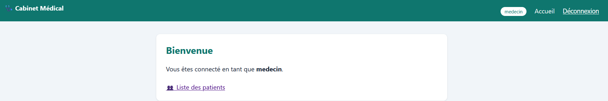

# Cabinet Médical ATCHOUM — infrastructure multi-sites sécurisée

Projet final du bootcamp Fullstack Cybersécurité de Jedha, mené en dix jours et présenté
au Demo Day du 12 août 2026.

Le sujet : un cabinet médical de campagne réparti sur deux sites, qui a besoin d'un portail
et d'une base de données communs pour ses praticiens. Des données de santé, donc du RGPD,
donc une infrastructure segmentée, chiffrée, supervisée — et auditée.

Le projet couvre la chaîne complète : concevoir l'infrastructure, développer l'application,
la durcir, la superviser, puis la faire attaquer par une autre équipe et traiter les
constats.

## L'équipe

Nathan Hemeidan · Melissa Marzin · Pierre Ménard · Ange Blot · **Rémy Miquel**

**Ma contribution :** supervision Wazuh (déploiement des agents, réglage des règles,
définition des journaux collectés), règles de filtrage pfSense, ACL sur les routeurs Cisco
IOU, et segmentation réseau — mise en place de la DMZ. J'ai également conduit le test
d'intrusion sur l'infrastructure de l'équipe adverse dans le cadre de l'exercice croisé.

## L'architecture en bref


Deux sites reliés par un tunnel IPsec entre deux pfSense. Côté site principal, une
architecture 3-tiers où chaque étage vit dans sa propre zone réseau :

```
Navigateur (patient / médecin)
      │ HTTPS 443
      ▼
  WEB-01 (DMZ, 192.168.30.2) ── Flask + nginx ── sert les pages, détient le jeton
      │ HTTPS 8443, filtré par pfSense
      ▼
  APP-01 (interne, 172.16.10.2) ── FastAPI ── RBAC et logique métier
      │ 5432
      ▼
  DATA-01 (interne, 172.16.20.2) ── PostgreSQL ── dossiers médicaux

  WAZUH (interne, 172.16.30.2) ── SIEM, reçoit les journaux des agents
```

WEB-01 ne parle jamais à la base. APP-01 porte le contrôle d'accès. Le détail de la
segmentation, du filtrage et du VPN est dans
[docs/architecture-et-segmentation.md](docs/architecture-et-segmentation.md).

## La documentation

| Document | Contenu |
|---|---|
| [architecture-et-segmentation.md](docs/architecture-et-segmentation.md) | zones réseau, DMZ, règles pfSense, ACL IOU, VPN IPsec, choix techniques et limites assumées |
| [wazuh-agent-web-01.md](docs/wazuh-agent-web-01.md) | déploiement de l'agent SIEM, journaux collectés, problèmes rencontrés et corrections |
| [securite-applicative.md](docs/securite-applicative.md) | CSRF, validation des entrées, limitation de débit, durcissement des jetons JWT |
| [ssh-par-cle.md](docs/ssh-par-cle.md) | passage en authentification par clé, désactivation des mots de passe, validation côté attaquant |
| [audit-croise-constats-remediation.md](docs/audit-croise-constats-remediation.md) | les cinq findings relevés sur notre infra, CVSS 3.1, plan de remédiation chiffré |
| [methodologie-pentest.md](docs/methodologie-pentest.md) | démarche PTES suivie pour auditer l'infrastructure adverse |

## Le code

```
app-01-backend/     API FastAPI — authentification, RBAC, accès base
web-01-frontend/    frontend Flask — pages, session, jeton
sql/                schéma de la base et script de peuplement
```



Contrôle d'accès à trois rôles, vérifié côté serveur à chaque requête :

| Action | patient | secrétariat | médecin |
|---|:---:|:---:|:---:|
| connexion (JWT) | ✓ | ✓ | ✓ |
| voir son propre dossier | ✓ | ✗ | ✓ (tous) |
| liste des patients | ✗ | ✓ (administratif) | ✓ (complet) |
| contenu médical | son dossier uniquement | ✗ | ✓ |
| prise de rendez-vous | ✓ | ✓ | ✓ |

## Déploiement

### APP-01 — base et API

```bash
sudo apt update && sudo apt install -y postgresql
sudo -u postgres psql <<'SQL'
CREATE DATABASE cabinet;
CREATE USER cabinet_service WITH PASSWORD '<mot-de-passe-fort>';
GRANT ALL PRIVILEGES ON DATABASE cabinet TO cabinet_service;
\c cabinet
GRANT ALL ON SCHEMA public TO cabinet_service;
SQL
```

`cabinet_service` est un compte de service à privilèges limités, distinct du compte
d'administration `postgres`.

```bash
cd app-01-backend
python3 -m venv venv && source venv/bin/activate
pip install -r requirements.txt

export DB_USER=cabinet_service
export DB_PASSWORD=<mot-de-passe-fort>
export DB_NAME=cabinet
export JWT_SECRET=$(openssl rand -hex 32)    # 32 caractères minimum, sinon l'API refuse de démarrer

python3 seed.py
uvicorn main:app --host 0.0.0.0 --port 8443
```

### WEB-01 — frontend

```bash
cd web-01-frontend
python3 -m venv venv && source venv/bin/activate
pip install -r requirements.txt

export API_URL=http://172.16.10.2:8443
export FLASK_SECRET=$(openssl rand -hex 32)

python3 app.py
```

Les comptes créés par `seed.py` sont des comptes de démonstration destinés au lab
(`dr_martin`, `secretaire`, `patient_durand`). Ils n'ont aucune raison d'exister ailleurs
que dans cet environnement de test.

## Périmètre

Infrastructure montée sous GNS3 avec des routeurs Cisco IOU, dans le cadre pédagogique de
la formation. Les tests d'intrusion mentionnés ont été conduits sur des systèmes de lab,
entre équipes, selon un périmètre défini par lettre de mission.
