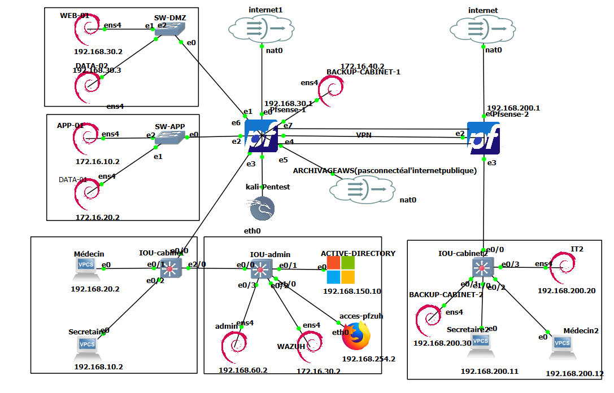
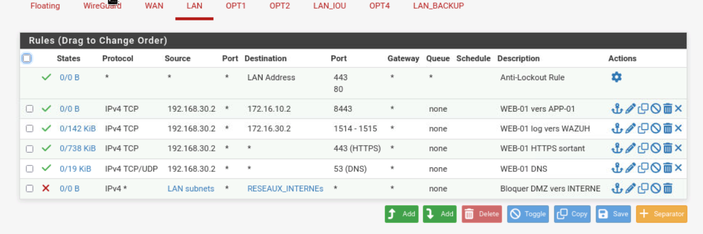
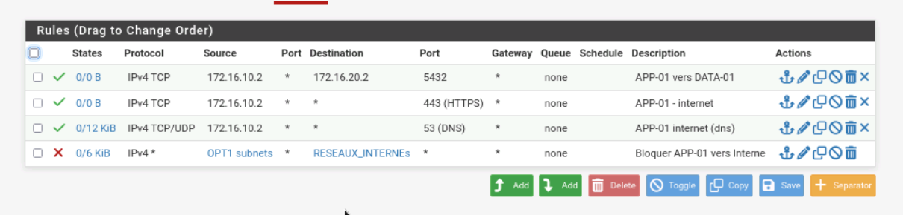
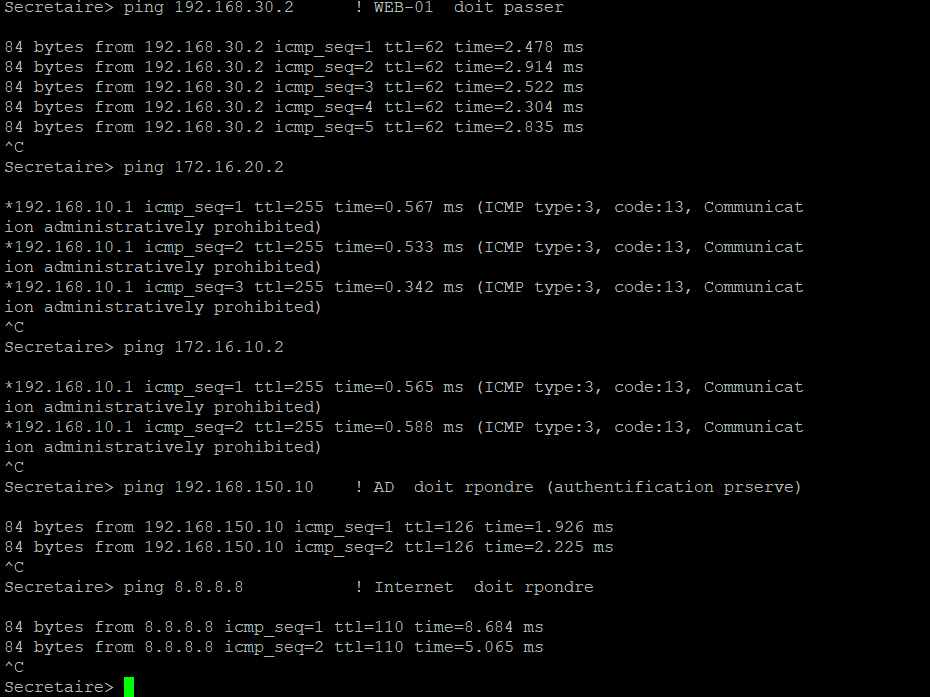
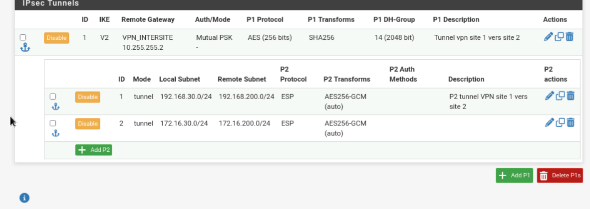
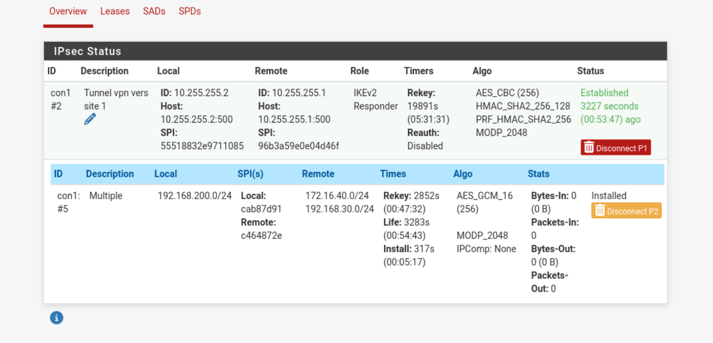
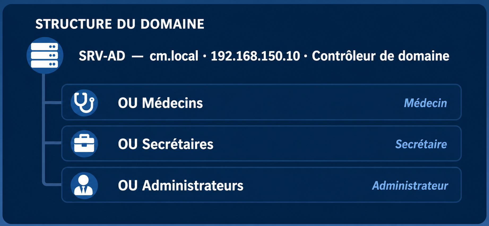
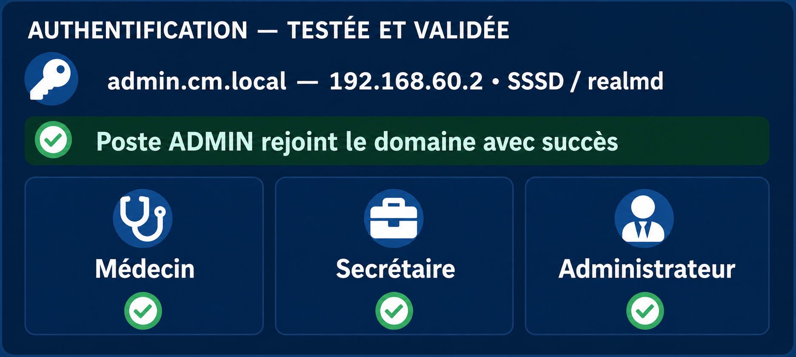
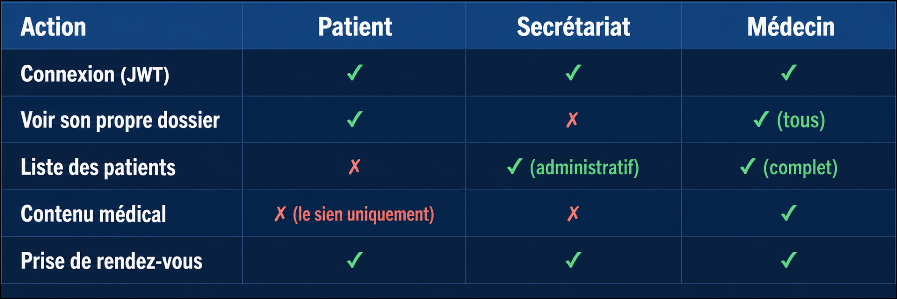
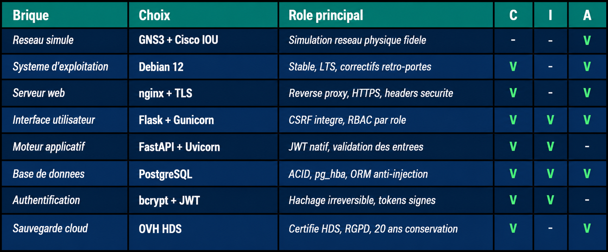

# Architecture et segmentation réseau

## Le contexte

Un cabinet médical de campagne réparti sur deux sites : un cabinet principal et une antenne
dans une autre ville, chacun avec un poste médecin et un poste secrétariat. Les praticiens
doivent accéder à un portail applicatif et à une base de données communes — consultations,
ordonnances, résultats d'analyses, dossiers partagés.

Deux contraintes structurent tout le reste :

- **Confidentialité** — ce sont des données de santé, sensibles au sens de l'article 9 du
  RGPD. Comment sécuriser l'accès distant aux dossiers entre deux sites éloignés ?
- **Disponibilité** — comment garantir aux praticiens un accès fiable et permanent aux
  ressources centralisées ?

L'ensemble est monté sous GNS3 avec des routeurs Cisco IOU, ce qui permet de simuler une
topologie physique réaliste plutôt qu'un simple réseau à plat.

## Vue d'ensemble



La maquette complète : les deux sites, les commutateurs SW-DMZ et SW-APP, les trois
routeurs Cisco IOU (cabinet, admin, cabinet2), les deux pfSense reliés par le tunnel VPN,
l'Active Directory, le serveur Wazuh, l'archivage OVH et le poste Kali utilisé pour les
tests.

Schématiquement :

```
        SITE 1 — Cabinet principal              SITE 2 — Antenne
     ┌──────────────────────────────┐     ┌──────────────────────────┐
     │  postes utilisateurs         │     │  postes utilisateurs     │
     │  poste ADMIN                 │     │  (médecin, secrétariat)  │
     │  Active Directory (cm.local) │     │                          │
     │                              │     │                          │
     │  DMZ ──── WEB-01             │     │                          │
     │  LAN ──── APP-01             │     │                          │
     │            DATA-01           │     │                          │
     │            WAZUH             │     │                          │
     └──────────┬───────────────────┘     └───────────┬──────────────┘
                │          VPN IPsec site-à-site      │
             pfSense ◄══════ tunnel chiffré ══════► pfSense-2
```

## Segmentation

Le découpage se fait **par usage**, pas par commodité : utilisateurs, serveurs,
administration. Chaque zone ne communique qu'avec ce dont elle a strictement besoin.

| Zone | Machine | Adresse | Exposition |
|---|---|---|---|
| DMZ | WEB-01 (Flask + nginx) | 192.168.30.2 | seule zone en contact avec l'extérieur |
| LAN interne | APP-01 (API FastAPI) | 172.16.10.2 | jamais exposée |
| LAN interne | DATA-01 (PostgreSQL) | 172.16.20.2 | verrouillée |
| LAN interne | WAZUH (SIEM) | 172.16.30.2 | jamais exposée |
| Archivage | sauvegardes | — | isolée d'Internet |

La logique 3-tiers découle directement de là : **WEB-01 ne parle jamais à la base**. Le
frontend détient le jeton de session, l'API porte le contrôle d'accès, la base n'est
joignable que depuis l'API. Si le frontend tombe, l'attaquant est bloqué avant la donnée —
c'est de la défense en profondeur, plusieurs couches à franchir plutôt qu'une seule porte.

Deux mécanismes se superposent pour protéger la base :

- au niveau réseau, les règles pfSense filtrent les flux entre zones
- au niveau PostgreSQL, `pg_hba.conf` n'autorise que l'IP d'APP-01 avec l'utilisateur
  `cabinet_user` — une connexion depuis une autre machine est refusée par la base
  elle-même, indépendamment du firewall

## Filtrage : pfSense et ACL IOU

Le filtrage se fait à deux niveaux. **pfSense** assure le routage entre zones, les règles
centralisées et le journal des connexions filtrées. Les **ACL sur les routeurs IOU**
appliquent un filtrage supplémentaire au plus près des segments, ce qui évite de faire
reposer toute la politique sur un point unique.

Les règles suivent le moindre privilège : on autorise explicitement ce qui doit passer,
tout le reste est bloqué. Concrètement, le poste ADMIN joint les serveurs en SSH (port 22),
les postes utilisateurs joignent WEB-01, les agents Wazuh remontent vers le manager — et
rien d'autre n'est ouvert par défaut.

Sur la DMZ, WEB-01 ne peut sortir que vers trois destinations précises — l'API sur 8443,
le serveur Wazuh sur 1514-1515, et HTTPS/DNS vers l'extérieur — puis une règle de blocage
explicite l'empêche d'atteindre les réseaux internes :



Même logique sur le segment applicatif : APP-01 atteint PostgreSQL sur 5432, sort en HTTPS
et DNS, et rien d'autre.



Côté routeurs IOU, les ACL sont vérifiées depuis un poste utilisateur — c'est la seule
façon de savoir si la politique écrite est réellement appliquée :



Le poste secrétariat atteint bien le portail web et l'Active Directory, mais ses paquets
vers la base de données et vers l'API reviennent en
`ICMP type 3 code 13 — Communication administratively prohibited`, émis par le routeur.
C'est la signature d'un refus d'ACL : le cloisonnement tient.

L'audit croisé a montré que cette politique avait un trou : depuis le poste Médecin2 du
site 2, la base de données et l'interface d'administration pfSense répondaient au ping.
C'est le finding F7, détaillé dans
[audit-croise-constats-remediation.md](audit-croise-constats-remediation.md).

## Liaison inter-sites : VPN IPsec

Plutôt que d'ouvrir des ports sur Internet — ce qui exposerait les services à n'importe
qui — les deux sites sont reliés par un tunnel IPsec entre les deux pfSense.

- **Phase 1 (IKE SA)** : les deux pfSense s'authentifient mutuellement par clé pré-partagée
  et établissent un canal sécurisé.
- **Phase 2 (Child SA)** : le tunnel de données est monté en AES-256 pour le chiffrement et
  SHA-256 pour l'intégrité. Plusieurs paires Phase 2 ont été définies pour couvrir les
  différents segments à faire communiquer.



Trois flux ont été validés de bout en bout : admin vers IT2, utilisateurs vers WEB-01, et
supervision vers Wazuh. Le tunnel monte et reste établi :



Le chiffrement en transit n'est pas un confort ici : le RGPD l'impose pour des données de
santé qui circulent entre deux sites.

## Identité et contrôle d'accès

Un domaine Active Directory (`cm.local`) centralise les identités — un compte, un rôle, un
seul point de vérité. Les utilisateurs sont rangés par unité d'organisation selon leur
fonction :



Les postes Linux rejoignent le domaine via SSSD et realmd. L'authentification a été validée
pour les trois profils :



Côté application, le contrôle d'accès repose sur trois rôles vérifiés côté serveur à chaque
requête :



| Action | patient | secrétariat | médecin |
|---|:---:|:---:|:---:|
| connexion (JWT) | ✓ | ✓ | ✓ |
| voir son propre dossier | ✓ | ✗ | ✓ (tous) |
| liste des patients | ✗ | ✓ (administratif) | ✓ (complet) |
| contenu médical | son dossier uniquement | ✗ | ✓ |
| prise de rendez-vous | ✓ | ✓ | ✓ |

Le contrôle est serveur, jamais client : on ne peut pas le contourner depuis le navigateur.

## Choix techniques

Chaque brique a été retenue pour ce qu'elle apporte aux trois piliers — confidentialité,
intégrité, disponibilité :



| Composant | Choix | Pourquoi |
|---|---|---|
| Virtualisation | GNS3 + Cisco IOU | simulation réseau fidèle, ACL réalistes |
| OS serveurs | Debian 12 | stable, correctifs rétro-portés |
| Serveur web | nginx + TLS | reverse proxy, HTTPS, en-têtes de sécurité |
| Base de données | PostgreSQL | contrôle d'accès fin via `pg_hba.conf` |
| Pare-feu | pfSense | filtrage inter-zones, VPN IPsec, règles centralisées |
| SIEM | Wazuh | open source, on-premise, FIM et détection de CVE inclus |

Wazuh a été retenu contre Splunk et Elastic : les deux sont plus puissants mais demandent
des licences coûteuses et une infrastructure plus lourde, disproportionnées ici. Wazuh
couvre le besoin — supervision multi-sites, détection de vulnérabilités, centralisation des
journaux — sans coût de licence.

## Limites assumées

Le projet a été mené en dix jours. Plusieurs points sont identifiés mais non traités, et
il vaut mieux les énoncer que les masquer :

- **pfSense est un point de défaillance unique.** S'il tombe, tout tombe. En production on
  déploierait deux pfSense en haute disponibilité avec CARP, un actif et un passif, avec
  bascule automatique.
- **Les services applicatifs ne redémarrent pas seuls.** gunicorn et uvicorn tournaient
  lancés en arrière-plan, sans unit systemd. Il faudrait un fichier de service avec
  `Restart=always` pour survivre à un redémarrage ou à un crash.
- **Les agents Wazuh ne couvrent pas encore APP-01 et DATA-01.** La collecte des journaux
  PostgreSQL sur DATA-01 est l'étape suivante, et c'est celle qui compte le plus pour la
  traçabilité RGPD des accès aux dossiers.
